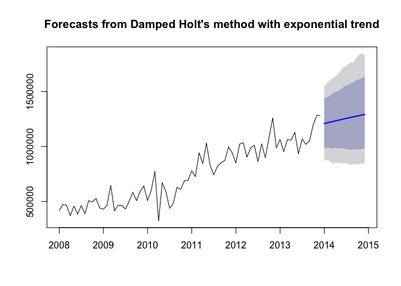

Introduction
============

For this Case Study we are going to look at the data provided by the
Chulwalran government. The objective its to find the most appropriate
model to forecast the exports for one of the selected plants. The plants
that Chulwalra exports are Efak, Wuge, Blue Etel, and Red Etel. I chose
to observed and predict the exports for Efak. The different types of
forecasting models I will use to attempt to predict the Efak future
exports are simple exponential smoothing, Holts exponential trend, and
Holt-Winter seasonal method.

First we must load fpp

    library(fpp)

    ## Warning: package 'forecast' was built under R version 3.2.5

    ## Warning: package 'zoo' was built under R version 3.2.5

    ## Warning: package 'fma' was built under R version 3.2.5

    ## Warning: package 'tseries' was built under R version 3.2.5

1. Importing Datasets
---------------------

No we must import the datasets, using the read.csv function

    ImportedAsIsData <- read.csv(file="ImportedAsIsDataChulwalar.csv", header = F, sep=";", fill = T) #chose ImportedAsIsDataChulwalar.csv

    ImportedPlanData <- read.csv("ImportedPlanDataChulwalar.csv", header = F, sep=";", fill = T) #chose ImportedPlanDataChulwalar.csv

    ImportedIndicators <- read.csv("ImportedIndicatorsChulwalar.csv", header = F, sep=";", fill = T) # chose ImportedIndicatorsChulwalar.csv

2.Cleaning the needed Data
--------------------------

Now we are extracting the necessary data from each file

    EfakAsIsVector <- c(ImportedAsIsData [16:27,2],ImportedAsIsData [16:27,3],ImportedAsIsData [16:27,4],ImportedAsIsData [16:27,5],ImportedAsIsData [16:27,6],ImportedAsIsData [16:27,7])

    EfakPlanVector <- c(ImportedPlanData[16:27,2],ImportedPlanData[16:27,3],ImportedPlanData[16:27,4],ImportedPlanData[16:27,5],ImportedPlanData[16:27,6],ImportedPlanData[16:27,7])

    EfakAsIs <- ts(EfakAsIsVector , start=c(2008,1), end=c(2013,12), frequency=12)

    EfakPlan <- ts(EfakPlanVector, start=c(2008,1), end=c(2013,12), frequency=12)

    YearAsIsVector <- c(ImportedAsIsData [86,2],ImportedAsIsData [86,3],ImportedAsIsData [86,4],ImportedAsIsData [86,5],ImportedAsIsData [86,6],ImportedAsIsData [86,7])

3. Exploring the Data
---------------------

Creating an STL for EFAK export

    EfakAsIs_stl <- stl(EfakAsIs , s.window=5)
    plot(EfakAsIs_stl, col="black", main="EfakAsIs_stl")

<!-- -->

Looking at the data there is somewhat of a seasonal trend. It is
important to note that the full Efak data set is continuously y
increasing. It also looks like exports of Efak pick up significantly
between 2010 and 2011.

The code below changes the seasonality into a monthly plot, so we can
view it in a different way.

    monthplot(EfakAsIs_stl$time.series[,"seasonal"], main="", ylab="Seasonal")

<!-- -->

#### CEPI Correlation:

First we are going to at the correlation between the change in Export
Price Index and the Efak Exports
<!-- -->

    ## [1] 0.9303543

A correlation of .93 would suggest that Efak exports and the Change in
Export Price Index are positively related, so the two variables have a
very strong positive linear relationship.

#### Monthly Satisfaction Index (SI) government based data

<!-- -->

    ## [1] 0.37934

Slightly postive correlation value.

#### Temperature Correlation

Next we look at the correlation between temperature and the Efak exports
<!-- -->

    ## [1] -0.07951179

A correlation of -.07 would suggest that Efak exports and Temperature
have a weak negative relationship, it makes sense that change in
temperatures may have an effect on Efak growth and exports

#### Births In Chulwalar

Next we are observing the correlation between monthly birthday and Efak
exports
<!-- -->

    ## [1] -0.05802961

A correlation of -.058 would suggest an almost negligible correlation
between monthly births and Efak Exports. According to the data provided,
experts thought there may be a correlation because workers would be
trying to export more goods to help pay for the cost of new children,
but this was apparently not the case. If anything you'd think the
correlation would be negative because time had to be taken off from
working hours to take care of newborns

#### Mothly Satisfaction Index

<!-- -->

    ## [1] 0.8358147

Not much is really explain about what this satisfaction index
incorporates but I am taking it to mean the customer satisfaction. This
being the case it makes sense that the correlation coefficient is .83,
which shows are very strong positive relationship. Happy customers means
more exports.

#### Yearly Exports from Urbano

<!-- -->

    ## [1] 0.9163565

Here we look at the correlation between exports from Urbano and Efak
exports, it makes senses the correlation is .916 because if exports from
Urbano increase, Efak exports should also increase. This relies on the
assumption that Efak is an export of Urbano. Ultimately we observe a
very strong postive correlation between the two variables.

#### Yearly number of Globalisation Party members in Chulwalar

<!-- -->

    ## [1] 0.8963942

Here we compare the number of Globalization party member and Efak
exports. Again we have a positive correlation coefficient of .896, which
would suggest a strong correlation between the two variables. Again this
makes sense because as Globalization increases it would makes sense that
exports increase as well.

#### Monthly Average Export Price

<!-- -->

    ## [1] 0.9056624

Here we are observing the correlation between monthly average export
price and Efak Exports. The correlation coefficient is .905. There is a
strong positive correlation between Efak exports and export price. My
guess is it’s a supply and demand thing, the more Efak exported the
higher the export price goes.

#### Monthly Producer Price Index (PPI) for Etel in Chulwalar

<!-- -->

    ## [1] 0.5865375

Slightly postive correlation, most likely because in increase in sales
for Etel would suggest an increase in sales for Efak

#### National Holidays

<!-- -->

    ## [1] 0.001235706

National Holidays and Efak exports have a correlation coefficient of
.001, which to me is almost statistically insignificant.

#### Chulwalar Index

<!-- -->

    ## [1] 0.7129557

The correlation coefficient for the Chulwalar Index and Efak exports is
.71, which means as the total value for all Chulwalar companies
increases, so does Efak exports. This makes sense because the more Efak
sales should increase the value of group of companies in Chulwalar.

#### Monthyl Inflation Rate

<!-- -->

    ## [1] 0.1454134

The correlation coefficient for the monthly inflation rate and Efak
exports is .145, so there is a slight positive correlation but nothing
that warrants any further analysis in my opinion.

#### Proposed spending for Independence Day

<!-- -->

    ## [1] 0.5243145

Here look at the correlation between spending for independence data and
Efak exports. The correlation coefficient is .52, which suggests a mild
positive correlation. This is a bit surprising to me, I think this can
buy the fact that when exports are high there is more money to be spent
on the Independence day celebration.

#### Influence of National Holidays

This indicator is an experiment where the influence of National Holidays
is extended into the months leading up to the holiday.
<!-- -->

    ## [1] 0.09926836

Here we look at the influence of national holidays, but this includes
months leading up to the holiday. The correlation coefficient is .099,
which means there is a very mild correlation but not one that I think
requires further analysis.

#### The External Satisfaction Index Offset

The indicator is to be offset by one month, to see if the index change
makes itself first noticeable on exports in the following months.

1 Month Correlation

<!-- -->

    ## [1] 0.3792706

2 Month Shift Correlation

<!-- -->

    ## [1] -0.06536442

No significant changes , the correlation coefficient is very small for
both the one month offset and the two month offset.

and creating a time series from the data

#### Model With All Indicators and with each Indicator individually

    # All Indiators in one model:
    ModelWithAlllIndicators <- tslm(EfakAsIs~ trend + season + CEPI + SIGov + Temperature + Births + SIExtern + UrbanoExports + GlobalisationPartyMembers + AEPI + PPIEtel + NationalHolidays + ChulwalarIndex + Inflation + IndependenceDayPresents)
    summary(ModelWithAlllIndicators)$adj.r.squared

    ## [1] 0.932576

    plot(EfakAsIs, col='grey')
    lines(fitted(ModelWithAlllIndicators), col='red')

<!-- -->

    # CEPI:
    ModelWithCEPI <- tslm(EfakAsIs ~ trend + season + CEPI)
    summary(ModelWithCEPI)$adj.r.squared

    ## [1] 0.9124729

    # SIGov:
    ModelWithSIGov <- tslm(EfakAsIs ~ trend + season + SIGov)
    summary(ModelWithSIGov)$adj.r.squared

    ## [1] 0.8879844

    # Temperature:
    ModelWithTemperature <- tslm(EfakAsIs ~ trend + season + Temperature)
    summary(ModelWithTemperature)$adj.r.squared

    ## [1] 0.8947486

    # Births:
    ModelWithBirths <- tslm(EfakAsIs ~ trend + season + Births)
    summary(ModelWithBirths)$adj.r.squared

    ## [1] 0.8899304

    # SIExtern:
    ModelWithSIExtern <- tslm(EfakAsIs ~ trend + season + SIExtern)
    summary(ModelWithSIExtern)$adj.r.squared

    ## [1] 0.8898599

    # UrbanoExports:
    ModelWithTotalUrbanoExports <- tslm(EfakAsIs ~ trend + season + UrbanoExports)
    summary(ModelWithTotalUrbanoExports)$adj.r.squared 

    ## [1] 0.9123491

    # GlobalisationPartyMembers:
    ModelWithGlobalisationPartyMembers <- tslm(EfakAsIs ~ trend + season + GlobalisationPartyMembers)
    summary(ModelWithGlobalisationPartyMembers)$adj.r.squared 

    ## [1] 0.8889456

    # AEPI:
    ModelWithAEPI <- tslm(EfakAsIs ~ trend + season + AEPI)
    summary(ModelWithAEPI)$adj.r.squared 

    ## [1] 0.9128523

    # PPIEtel:
    ModelWithPPIEtel <- tslm(EfakAsIs ~ trend + season + PPIEtel)
    summary(ModelWithPPIEtel)$adj.r.squared

    ## [1] 0.8867125

    # NationalHolidays:
    ModelWithNationalHolidays <- tslm(EfakAsIs ~ trend + season + NationalHolidays)
    summary(ModelWithNationalHolidays)$adj.r.squared

    ## [1] 0.8912933

    # ChulwalarIndex:
    ModelWithChulwalarIndex <- tslm(EfakAsIs ~ trend + season + ChulwalarIndex)
    summary(ModelWithChulwalarIndex)$adj.r.squared 

    ## [1] 0.894134

    # Inflation:
    ModelWithInflation <- tslm(EfakAsIs ~ trend + season + Inflation)
    summary(ModelWithInflation)$adj.r.squared

    ## [1] 0.9086786

    # IndependenceDayPresents:
    ModelWithIndependenceDayPresents <- tslm(EfakAsIs ~ trend + season + IndependenceDayPresents)
    summary(ModelWithIndependenceDayPresents)$adj.r.squared

    ## [1] 0.8938877

    # InfluenceNationalHolidays:
    ModelWithInfluenceNationalHolidays <- tslm(EfakAsIs ~ trend + season + InfluenceNationalHolidays)
    summary(ModelWithInfluenceNationalHolidays)$adj.r.squared

    ## [1] 0.8912933

Looking at all the adj R sqrt values for the models above it seems like
the the highest the Model With all Indicators followed by CEPI, Urbano
Exports and then is AEPI. Looking at the plot its clear that model
somewhat follows the Efak trend. So when we begin forecasting we will
know where to start

#### Model With High and Low Correlating Indicators

    #ModelWithHighCorrelatingIndicators                                 

    # In this model only the indicators that correlate well with eachother have been used.  

    ModelWithHighCorrelatingIndicators <- tslm(EfakAsIs ~ trend + season + CEPI + SIExtern + UrbanoExports + GlobalisationPartyMembers + AEPI)
    summary(ModelWithHighCorrelatingIndicators)$adj.r.squared 

    ## [1] 0.9215918

    # It can be seen that the addition of these indicators causes the seasonality to be weakened. 

    ModelWithLowCorrelatingIndicators <- tslm(EfakAsIs ~ trend + season + NationalHolidays + UrbanoExports + GlobalisationPartyMembers)
    summary(ModelWithLowCorrelatingIndicators)$adj.r.squared 

    ## [1] 0.9258877

    # It can be seen that the addition of these indicators causes the seasonality to be weakened. 

    ModelWithTrendAndSeasonalityOnly <- tslm(EfakAsIs ~ trend + season)
    summary(ModelWithTrendAndSeasonalityOnly)$adj.r.squared

    ## [1] 0.8880626

Here we see that the adj R is highest for the Model With Low Correlating
Indicators. It is .925

#### Model With Efak Exports Indicators

    # ModelWithEfakExportsIndicators will be matched with a set of indicators that correlate with the Efak exports.
    ModelWithEfakExportsIndicators <- tslm(EfakAsIs  ~ trend + season + CEPI + UrbanoExports + AEPI + GlobalisationPartyMembers)
    summary(ModelWithEfakExportsIndicators)$adj.r.squared 

    ## [1] 0.9229985

    plot(EfakAsIs, col='grey')
    lines(fitted(ModelWithEfakExportsIndicators), col='red')

<!-- -->

    ModelEfakSalesWithCEPI <- tslm(EfakAsIs  ~ trend + season + CEPI)
    summary(ModelEfakSalesWithCEPI)$adj.r.squared 

    ## [1] 0.9124729

    # ModelEfakSalesWithTrendAnsSeasonalityOnly does not seem to be anything special, but it returns fairly good results.
    ModelEfakSalesWithTrendAnsSeasonalityOnly <- tslm(EfakAsIs  ~ trend + season)
    summary(ModelEfakSalesWithTrendAnsSeasonalityOnly)$adj.r.squared 

    ## [1] 0.8880626

    ModelWithCEPIOnly <- tslm(EfakAsIs  ~ CEPI)
    summary(ModelWithCEPIOnly)$adj.r.squared 

    ## [1] 0.8636386

    # A Forecast based entirely on the CEPI is not convincing

Here we see that the adj r is highest for the Model with Efak Exports as
Indicators. This makes sense because the model should reflect Efak
exports.

4. Predictive modelling
=======================

Now we are using the various provided models to find the an accurate
prediction forecast for the Efak data.To find a better model we are
going to compare AIC, AICc, BIC, and the Error Measures. AIC is the
measure of relative quality of statistical models. For this analysis,
the lower the AIC means the model minimizes information loss, and
therefor may fit the data better. AICc is AIC but it corrects for finite
sample sizes. RMSE shows the absolute fit of the model to the data.
Since it is the square root of the variance of the residuals, it is an
absolute measure of fit.

###### Shorten the time series in order to test the forecasts

### Forecast Model With High Correlating Indicators

    # Shorten ModelWithHighCorrelatingIndicators by one year in order to be able to produce a forecast for 2013. 
    ModelWithHighCorrelatingIndicators_2012 <- tslm(EfakAsIs_2012 ~ trend + season + CEPI_2012 + SIExtern_2012 + UrbanoExports_2012 + GlobalisationPartyMembers_2012 + AEPI_2012)
    AIC(ModelWithHighCorrelatingIndicators_2012) 

    ## [1] 1528.65

    summary(ModelWithHighCorrelatingIndicators_2012)$sigma

    ## [1] 71788.86

    # Add "newdata" to the 2013 indicator values for the forecast 
    ModelWithHighCorrelatingIndicators_Forecast <- forecast(ModelWithHighCorrelatingIndicators_2012,newdata=data.frame(CEPI_2012=CEPI_2013, SIExtern_2012=SIExtern_2013, UrbanoExports_2012= UrbanoExports_2013, GlobalisationPartyMembers_2012=GlobalisationPartyMembers_2013, AEPI_2012=AEPI_2013),h=12)
    plot(ModelWithHighCorrelatingIndicators_Forecast, main="ModelWithHighCorrelatingIndicators_Forecast")

<!-- -->

    #ModelWithHighCorrelatingIndicators_Forecast

    # In order to be able to correlate the Forecast with the As Is Data, it is necessary to convert the Point 
    # Estimator into a time series. 
    ModelWithHighCorrelatingIndicators_Forecast_df <-as.data.frame(ModelWithHighCorrelatingIndicators_Forecast) 
    ModelWithHighCorrelatingIndicators_PointForecast <- ts(ModelWithHighCorrelatingIndicators_Forecast_df$"Point Forecast", start=c(2013,1), end=c(2013,12), frequency=12)

    # Correlation of the forecasts and As Is Data. As a comparison, the correlation of the As Is Data for 2013 with the Plan Data. 
    cor(ModelWithHighCorrelatingIndicators_PointForecast, EfakAsIs_2013) 

    ## [1] 0.5918766

    cor(EfakAsIs_2013, EfakPlan_2013)

    ## [1] 0.2513655

    # A Comparison with linear regression also supports the result.
    ModelWithHighCorrelatingIndicators_forecast_lm <- lm(EfakAsIs_2013 ~ ModelWithHighCorrelatingIndicators_PointForecast, data = EfakAsIs_2013)
    EfakAsIs_2013_lm <- lm(EfakAsIs_2013 ~ EfakAsIs_2013, data = EfakAsIs_2013)

    ## Warning in model.matrix.default(mt, mf, contrasts): the response appeared
    ## on the right-hand side and was dropped

    ## Warning in model.matrix.default(mt, mf, contrasts): problem with term 1 in
    ## model.matrix: no columns are assigned

    #summary(ModelWithHighCorrelatingIndicators_forecast_lm)
    #summary(EfakAsIs_2013_lm)

This AIC value for ModelWithHighCorrelatingIndicators\_2012 is very low:
1528, which makes sense because its modeled with high correlating
indicators.

### Forecast Model With Low Correlating Indicators

    # Shorten ModelWithLowCorrelatingIndicators by one year in order to be able to produce a forecast for 2013. 
    ModelWithLowCorrelatingIndicators_2012 <- tslm(EfakAsis_2012 ~ trend + season + NationalHolidays_2012 + UrbanoExports_2012 + GlobalisationPartyMembers_2012)
    AIC(ModelWithLowCorrelatingIndicators_2012)

    ## [1] 1524.105

    summary(ModelWithLowCorrelatingIndicators_2012)$sigma

    ## [1] 69820.62

    # Add "newdata" to the 2013 indicator values for the forecast 
    ModelWithLowCorrelatingIndicators_Forecast <- forecast(ModelWithLowCorrelatingIndicators_2012,newdata=data.frame(NationalHolidays_2012=NationalHolidays_2013, UrbanoExports_2012= UrbanoExports_2013, GlobalisationPartyMembers_2012=GlobalisationPartyMembers_2013),h=12)
    plot(ModelWithLowCorrelatingIndicators_Forecast, main="ModelWithLowCorrelatingIndicators_Forecast")

<!-- -->

    #ModelWithLowCorrelatingIndicators_Forecast

    # In order to be able to correlate the Forecast with the As Is Data, it is necessary to convert the Point 
    # Estimator into a time series. 
    ModelWithLowCorrelatingIndicators_Forecast_df <-as.data.frame(ModelWithLowCorrelatingIndicators_Forecast) 
    ModelWithLowCorrelatingIndicators_PointForecast <- ts(ModelWithLowCorrelatingIndicators_Forecast_df$"Point Forecast", start=c(2013,1), end=c(2013,12), frequency=12)

    # Correlation of the forecasts and As Is Data. As a comparison, the correlation of the As Is Data for 2013 with the Plan Data. 
    cor(ModelWithLowCorrelatingIndicators_PointForecast, EfakAsIs_2013) 

    ## [1] 0.6889908

    cor(EfakAsIs_2013, EfakPlan_2013)

    ## [1] 0.2513655

    # A Comparison with linear regression also supports the result.
    ModelWithLowCorrelatingIndicators_forecast_lm <- lm(EfakAsIs_2013 ~ ModelWithLowCorrelatingIndicators_PointForecast, data = EfakAsIs_2013)
    EfakAsis_2013_lm <- lm(EfakAsIs_2013 ~ EfakPlan_2013, data = EfakAsIs_2013)
    #summary(ModelWithLowCorrelatingIndicators_forecast_lm)
    #summary(EfakAsIs_2013_lm)

This AIC value for ModelWithLowCorrelatingIndicators\_2012 is also very
small. It is 1524, which means this model may fit better than the
pervious one.

### Forecast Model With Trend And Seasonality Only

    # Shorten ModelWithTrendAndSeasonalityOnly by one year in order to be able to produce a forecast for 2013.
    ModelWithTrendAndSeasonalityOnly_2012 <- tslm(EfakAsIs_2012 ~ trend + season)
    AIC(ModelWithTrendAndSeasonalityOnly_2012) 

    ## [1] 1553.791

    summary(ModelWithTrendAndSeasonalityOnly_2012)$sigma

    ## [1] 90952.15

    # Add "newdata" to the 2013 indicator values for the forecast.
    ModelWithTrendAndSeasonalityOnly_Forecast <- forecast(ModelWithTrendAndSeasonalityOnly_2012,h=12)
    plot(ModelWithTrendAndSeasonalityOnly_Forecast, main="ModelWithTrendAndSeasonalityOnly_Forecast")

<!-- -->

    #ModelWithTrendAndSeasonalityOnly_Forecast

    # In order to be able to correlate the Forecast with the As Is Data, it is necessary to convert the Point 
    # Estimator into a time series. 
    ModelWithTrendAndSeasonalityOnly_Forecast_df <-as.data.frame(ModelWithTrendAndSeasonalityOnly_Forecast) 
    ModelWithTrendAndSeasonalityOnly_PointForecast <- ts(ModelWithTrendAndSeasonalityOnly_Forecast_df$"Point Forecast", start=c(2013,1), end=c(2013,12), frequency=12)

    # Correlation of the forecasts and As Is Data. As a comparison, the correlation of the As Is Data for 2013 with the Plan Data.
    cor(ModelWithTrendAndSeasonalityOnly_PointForecast, EfakAsIs_2013) 

    ## [1] 0.5990717

    cor(EfakAsIs_2013, EfakPlan_2013)

    ## [1] 0.2513655

    # A Comparison with linear regression also supports the result.
    ModelWithTrendAndSeasonalityOnly_Forecast_lm <- lm(EfakAsIs_2013 ~ ModelWithTrendAndSeasonalityOnly_PointForecast, data = EfakAsIs_2013)
    EfakAsIs_2013_lm <- lm(EfakAsIs_2013 ~ EfakPlan_2013, data = EfakAsIs_2013)
    #summary(ModelWithTrendAndSeasonalityOnly_Forecast_lm)
    #summary(EfakAsIs_2013_lm)

This AIC value for ModelWithTrendAndSeasonality is 1553 which is larger
than the previous model, this suggest it does not forcast Efak trends as
well.

### Forecast Model With Efak Exports Indicators

    # Shorten the variables in ModelWithEfakExportsIndicators by one year in order to be able to produce a forecast for 2013.
    ModelWithEfakExportsIndicators_2012 <- tslm(EfakAsIs_2012 ~ trend + season + CEPI_2012 + UrbanoExports_2012 + AEPI_2012)
    ModelEfakSalesWithCEPI_2012 <- tslm(EfakAsIs_2012 ~ trend + season + CEPI_2012)
    ModelEfakSalesWithTrendAnsSeasonalityOnly_2012 <- tslm(EfakAsIs_2012 ~ trend + season)
    ModelWithCEPIOnly_2012 <- tslm(EfakAsIs_2012 ~ CEPI_2012)
    AIC(ModelWithEfakExportsIndicators_2012)

    ## [1] 1527.057

    summary(ModelWithEfakExportsIndicators_2012)$sigma

    ## [1] 71559.24

    AIC(ModelEfakSalesWithCEPI_2012) 

    ## [1] 1529.805

    summary(ModelEfakSalesWithCEPI_2012)$sigma

    ## [1] 74034.53

    AIC(ModelEfakSalesWithTrendAnsSeasonalityOnly_2012)

    ## [1] 1553.791

    summary(ModelEfakSalesWithTrendAnsSeasonalityOnly_2012)$sigma

    ## [1] 90952.15

    AIC(ModelWithCEPIOnly_2012)

    ## [1] 1551.352

    summary(ModelWithCEPIOnly_2012)$sigma

    ## [1] 96369.45

    # Add "newdata" to the 2013 indicator values for the forecast.
    ModelWithEfakExportsIndicators_Forecast <- forecast(ModelWithEfakExportsIndicators_2012, newdata=data.frame(CEPI_2012=CEPI_2013, UrbanoExports_2012 = UrbanoExports_2013, AEPI_2012 = AEPI_2013),h=12)
    ModelEfakSalesWithCEPI_Forecast <- forecast(ModelEfakSalesWithCEPI_2012, , newdata=data.frame(CEPI_2012=CEPI_2013), h=12)
    ModelEfakSalesWithTrendAnsSeasonalityOnly_Forecast <- forecast(ModelEfakSalesWithTrendAnsSeasonalityOnly_2012,h=12)
    ModelWithCEPIOnly_Forecast <- forecast(ModelWithCEPIOnly_2012, , newdata=data.frame(CEPI_2012=CEPI_2013), h=12)

    par(mfrow=c(2,2))

    plot(ModelWithEfakExportsIndicators_Forecast, main="ModelWithEfakExportsIndicators_Forecast")
    plot(ModelEfakSalesWithCEPI_Forecast, main="ModelEfakSalesWithCEPI_Forecast")
    plot(ModelEfakSalesWithTrendAnsSeasonalityOnly_Forecast, main="ModelEfakSalesWithTrendAnsSeasonalityOnly_Forecast")
    plot(ModelWithCEPIOnly_Forecast, main="ModelWithCEPIOnly_Forecast")

<!-- -->

    # In order to be able to correlate the Forecast with the As Is Data, it is necessary to convert the Point 
    # Estimator into a time series.
    ModelWithEfakExportsIndicators_Forecast_df <-as.data.frame(ModelWithEfakExportsIndicators_Forecast) 
    ModelEfakSalesWithCEPI_Forecast_df <-as.data.frame(ModelEfakSalesWithCEPI_Forecast) 
    ModelEfakSalesWithTrendAnsSeasonalityOnly_Forecast_df <-as.data.frame(ModelEfakSalesWithTrendAnsSeasonalityOnly_Forecast) 
    ModelWithCEPIOnly_Forecast_df <-as.data.frame(ModelWithCEPIOnly_Forecast) 
    ModelWithEfakExportsIndicators_PointForecast <- ts(ModelWithEfakExportsIndicators_Forecast_df$"Point Forecast", start=c(2013,1), end=c(2013,12), frequency=12)
    ModelEfakSalesWithCEPI_PointForecast <- ts(ModelEfakSalesWithCEPI_Forecast_df$"Point Forecast", start=c(2013,1), end=c(2013,12), frequency=12)
    ModelEfakSalesWithTrendAnsSeasonalityOnly_PointForecast <- ts(ModelEfakSalesWithTrendAnsSeasonalityOnly_Forecast_df$"Point Forecast", start=c(2013,1), end=c(2013,12), frequency=12)
    ModelWithCEPIOnly_PointForecast <- ts(ModelWithCEPIOnly_Forecast_df$"Point Forecast", start=c(2013,1), end=c(2013,12), frequency=12)

    # Correlation of the forecasts and As Is Data. As a comparison, the correlation of the As Is Data for 2013 with the Plan Data.
    cor(ModelWithEfakExportsIndicators_PointForecast, EfakAsIs_2013) 

    ## [1] 0.5994128

    cor(ModelEfakSalesWithCEPI_PointForecast, EfakAsIs_2013) 

    ## [1] 0.5919143

    cor(ModelEfakSalesWithTrendAnsSeasonalityOnly_PointForecast, EfakAsIs_2013) 

    ## [1] 0.5990717

    cor(ModelWithCEPIOnly_PointForecast, EfakAsIs_2013)

    ## [1] 0.4873009

    cor(EfakAsIs_2013, EfakPlan_2013)

    ## [1] 0.2513655

Looking at the Efak Exports as Indicator, the AIC values are still not
as small as the Model using low correlation Indicators.

### Forecast Model With Total Urbano Exports

    # Shorten the variables in ModelWithTotalUrbanoExports by one year in order to be able to produce a forecast for 2013.
    ModelWithTotalUrbanoExports_2012 <- tslm(EfakAsIs_2012 ~ trend + season + UrbanoExports_2012)
    AIC(ModelWithTotalUrbanoExports_2012) 

    ## [1] 1523.402

    summary(ModelWithTotalUrbanoExports_2012)$sigma

    ## [1] 70187.7

    # Add "newdata" to the 2013 indicator values for the forecast.
    ModelWithTotalUrbanoExports_Forecast <- forecast(ModelWithTotalUrbanoExports_2012, newdata=data.frame(UrbanoExports_2012=UrbanoExports_2013), h=12)
    plot(ModelWithTotalUrbanoExports_Forecast,main="ModelWithTotalUrbanoExports_Forecast")

<!-- -->

    #ModelWithTotalUrbanoExports_Forecast

    # In order to be able to correlate the Forecast with the As Is data, it is necessary to convert the Point 
    # Estimator into a time series. 
    ModelWithTotalUrbanoExports_Forecast_df <-as.data.frame(ModelWithTotalUrbanoExports_Forecast) 
    ModelWithTotalUrbanoExports_PointForecast <- ts(ModelWithTotalUrbanoExports_Forecast_df$"Point Forecast", start=c(2013,1), end=c(2013,12), frequency=12)

    # Correlation of the forecasts and As Is Data. As a comparison, the correlation of the As Is Data for 2013 with the Plan Data.
    cor(ModelWithTotalUrbanoExports_PointForecast, EfakAsIs_2013) 

    ## [1] 0.5990717

    cor(EfakAsIs_2013, EfakPlan_2013)

    ## [1] 0.2513655

The AIC value for this model is 1523, which is lower than all models we
have observed previously. This would suggest that this model has the
best fit.

### Forecast Model With National Holidays

    # Shorten the variables in ModelWithNationalHolidays by one year in order to be able to produce a forecast for 2013.
    ModelWithNationalHolidays_2012 <- tslm(EfakAsIs_2012 ~ trend + season + NationalHolidays_2012)
    AIC(ModelWithNationalHolidays_2012) 

    ## [1] 1554.695

    summary(ModelWithNationalHolidays_2012)$sigma

    ## [1] 91099.15

    # Add "newdata" to the 2013 indicator values for the forecast.
    ModelWithNationalHolidays_Forecast <- forecast(ModelWithNationalHolidays_2012, newdata=data.frame(NationalHolidays_2012=NationalHolidays_2013), h=12)
    plot(ModelWithNationalHolidays_Forecast,main="ModelWithNationalHolidays_Forecast")

<!-- -->

    ModelWithNationalHolidays_Forecast

    ##          Point Forecast     Lo 80   Hi 80     Lo 95   Hi 95
    ## Jan 2013        1028393  894644.0 1162141  821335.2 1235450
    ## Feb 2013        1089737  955988.4 1223485  882679.6 1296794
    ## Mar 2013        1152430  999130.5 1305730  915105.4 1389755
    ## Apr 2013        1056665  903365.5 1209965  819340.4 1293990
    ## May 2013        1154404 1020655.4 1288152  947346.6 1361461
    ## Jun 2013        1088052  954303.8 1221801  880995.0 1295110
    ## Jul 2013        1019428  885679.4 1153176  812370.6 1226485
    ## Aug 2013        1076141  942392.8 1209890  869084.0 1283199
    ## Sep 2013        1126565  992816.8 1260314  919508.0 1333623
    ## Oct 2013        1144879 1011130.6 1278628  937821.8 1351936
    ## Nov 2013        1245277 1111528.8 1379026 1038220.0 1452335
    ## Dec 2013        1172770 1039021.0 1306518  965712.2 1379827

    # In order to be able to correlate the Forecast with the As Is data, it is necessary to convert the Point 
    # Estimator into a time series.
    ModelWithNationalHolidays_Forecast_df <-as.data.frame(ModelWithNationalHolidays_Forecast) 
    ModelWithNationalHolidays_PointForecast <- ts(ModelWithNationalHolidays_Forecast_df$"Point Forecast", start=c(2013,1), end=c(2013,12), frequency=12)

    # Correlation of the forecasts and As Is Data. As a comparison, the correlation of the As Is data for 2013 with the Plan Data.
    cor(ModelWithNationalHolidays_PointForecast, EfakAsIs_2013) 

    ## [1] 0.6889908

The AIC value for ModelWithNationalHolidays\_2012 is 1554, still higher
than the total Urbano Exports model

### Forecast Model With Influence National Holidays

    # Shorten the variables in ModelWithInfluenceNationalHolidays by one year in order to be able to produce a forecast for 2013.
    ModelWithInfluenceNationalHolidays_2012 <- tslm(EfakAsIs_2012 ~ trend + season + InfluenceNationalHolidays_2012)
    AIC(ModelWithInfluenceNationalHolidays_2012) 

    ## [1] 1554.695

    summary(ModelWithInfluenceNationalHolidays_2012)$sigma

    ## [1] 91099.15

    # Add "newdata" to the 2013 indicator values for the forecast.
    ModelWithInfluenceNationalHolidays_Forecast <- forecast(ModelWithInfluenceNationalHolidays_2012, newdata=data.frame(InfluenceNationalHolidays_2012=InfluenceNationalHolidaysVector_2013), h=12)
    plot(ModelWithInfluenceNationalHolidays_Forecast,main="ModelWithInfluenceNationalHolidays_Forecast")

<!-- -->

    #ModelWithInfluenceNationalHolidays_Forecast

    # In order to be able to correlate the Forecast with the As Is Data, it is necessary to convert the Point 
    # Estimator into a time series.
    ModelWithInfluenceNationalHolidays_Forecast_df <-as.data.frame(ModelWithInfluenceNationalHolidays_Forecast) 
    ModelWithInfluenceNationalHolidays_PointForecast <- ts(ModelWithInfluenceNationalHolidays_Forecast_df$"Point Forecast", start=c(2013,1), end=c(2013,12), frequency=12)

    # Correlation of the forecasts and As Is Data. As a comparison, the correlation of the As Is Data for 2013 with the Plan Data.
    cor(ModelWithInfluenceNationalHolidays_PointForecast, EfakAsIs_2013) 

    ## [1] 0.6889908

    cor(EfakAsIs_2013, EfakPlan_2013)

    ## [1] 0.2513655

The national holidays model has a larger AIC of 1554, than the Urbano
Exports, this makes sense because when we looked the correlation between
the two variables it didn’t seem like either had a significant impact on
the other

### Forecast for 2014

    # As ModelWithLowCorrelatingIndicators was the one of best fitting model for a forecast, the exports data for 2014 will be forecast
    # based on trend and seasonality and NationalHolidays, UrbanoExports and GlobalisationPartyMembers. 
    AIC(ModelWithLowCorrelatingIndicators)

    ## [1] 1831.513

    summary(ModelWithLowCorrelatingIndicators)$sigma

    ## [1] 72362.98

    Forecast_ModelWithLowCorrelatingIndicators_2014 <- forecast(ModelWithLowCorrelatingIndicators,newdata=data.frame(NationalHolidays=NationalHolidays_2014, UrbanoExports= UrbanoExports_2014, GlobalisationPartyMembers=GlobalisationPartyMembers_2014),h=12)
    plot(Forecast_ModelWithLowCorrelatingIndicators_2014, main="Forecast_2014")

<!-- -->

    Forecast_ModelWithLowCorrelatingIndicators_2014_df <-as.data.frame(Forecast_ModelWithLowCorrelatingIndicators_2014) 
    PointForecast_ModelWithLowCorrelatingIndicators_2014 <- ts(Forecast_ModelWithLowCorrelatingIndicators_2014_df$"Point Forecast", start=c(2014,1), end=c(2014,12), frequency=12)
    PointForecast_ModelWithLowCorrelatingIndicators_2014

    ##          Jan     Feb     Mar     Apr     May     Jun     Jul     Aug
    ## 2014 1115981 1148284 1292888 1064446 1231463 1143742 1109305 1148268
    ##          Sep     Oct     Nov     Dec
    ## 2014 1195270 1235112 1333197 1272251

    cor(EfakAsIs,EfakPlan)

    ## [1] 0.9055081

    # As ModelWithTrendAndSeasonalityOnly also gave a well fitting model for a forecast, the exports data for 2014 will be forecast
    # based on trend and seasonality. 
    AIC(ModelWithTrendAndSeasonalityOnly)

    ## [1] 1858.961

    summary(ModelWithTrendAndSeasonalityOnly)$sigma

    ## [1] 88932.21

    Forecast_2014 <- forecast(ModelWithTrendAndSeasonalityOnly,h=12)
    plot(Forecast_2014, main="Forecast_2014")

<!-- -->

    Forecast_2014_df <-as.data.frame(Forecast_2014) 
    PointForecast_TrendAndSeasonality_2014 <- ts(Forecast_2014_df$"Point Forecast", start=c(2014,1), end=c(2014,12), frequency=12)
    PointForecast_TrendAndSeasonality_2014

    ##          Jan     Feb     Mar     Apr     May     Jun     Jul     Aug
    ## 2014 1167903 1200207 1315126 1146053 1283385 1195665 1161228 1200191
    ##          Sep     Oct     Nov     Dec
    ## 2014 1247193 1287035 1385120 1324174

    cor(EfakAsIs,EfakPlan)

    ## [1] 0.9055081

    # Output instruction for the data export of the results for further use in Excel. 
    #write.csv(PointForecast_TrendAndSeasonality_2014,file='PointForecast_TrendAndSeasonality_2014.csv')

    ### ALTERNATIVE###
    # As the indiators NationalHolidays delievered a good result, but could not convince in the 2013 forecast,
    # it could be possible that the data for 2013 was to blame. Therefore there is another Forecast using the
    # ModelWithNationalHolidays
    AIC(ModelWithNationalHolidays)

    ## [1] 1857.621

    summary(ModelWithNationalHolidays)$sigma

    ## [1] 87639.44

    Forecast_2014_alternative <- forecast(ModelWithNationalHolidays, newdata=data.frame(NationalHolidays=NationalHolidays_2014),h=12)
    plot(Forecast_2014_alternative,main="Forecast_2014_alternative")

<!-- -->

    Forecast_2014_alternative_df <-as.data.frame(Forecast_2014_alternative) 
    PointForecast_2014_alternative <- ts(Forecast_2014_alternative_df$"Point Forecast", start=c(2014,1), end=c(2014,12), frequency=12)
    PointForecast_2014_alternative

    ##          Jan     Feb     Mar     Apr     May     Jun     Jul     Aug
    ## 2014 1167903 1200207 1344811 1116369 1283385 1195665 1161228 1200191
    ##          Sep     Oct     Nov     Dec
    ## 2014 1247193 1287035 1385120 1324174

The forecast for 2014 has a much higher AIC of 1831, just using the
exports of 2014 doesn’t seem like it would provide a well fitting
forecast for future Efak exports.The alternative did not provide a great
fit either.

Base Model-Simple Exponential Smooth
------------------------------------

Not a very sophisticated model, it is essentially assuming that the
model will increase exponentially with no trend or seasonal
accommodation. Seeing as how there some seasonal trend in the Efak data,
this model will obviously not be the most accomidating. We will use this
model as the base fit and try to find a model that fits better.

    Model_ses <- ses(EfakAsIs, h=12)
    plot(Model_ses)

<!-- -->

    # 
    #    AIC     AICc      BIC 
    #1977.827 1978.001 1982.380 
    # 
    # Error measures:
    #                    ME     RMSE      MAE      MPE     MAPE      MASE       ACF1
    # Training set 28255.57 105746.4 83785.28 1.618532 12.24071 0.5987073 -0.1644141
    # The Akaike's Information Criterion(AIC/AICc) or the Bayesian Information 
    # Criterion (BIC) should be at minimum.

    plot(Model_ses, plot.conf=FALSE, ylab="Exports Chulwalar  )", xlab="Year", main="", fcol="white", type="o")
    lines(fitted(Model_ses), col="green", type="o")
    lines(Model_ses$mean, col="blue", type="o")
    legend("topleft",lty=1, col=c(1,"green"), c("data", expression(alpha == 0.671)),pch=1)

<!-- -->

### Holts Linear Trend Model

Holts linear Trend Model is An extension of the base model for simple
exponential smoothing. Holts linear model enables forecasting that
incorporates trends. The four different types of Holts Linear Trend
models that we can test are, Linear Trend, Exponential trend,
Exponential Damped and Additive Damped Trend. The predicted model is not
longer flat because of the estimated trend in each instance.

    Model_holt_1 <- holt(EfakAsIs,h=12)
    plot(Model_holt_1)

<!-- -->

    #this model assumes a linear model
    # The trend is exponential if the intercepts(level) and the gradient (slope) are
    # multiplied with eachother. The values are worse. As the Beta was very low in 
    # the optimisation, the forecast is very similar to the ses() model. 
    #    AIC     AICc      BIC 
    #1975.610 1976.207 1984.717  
    # 
    # Error measures:
    #                    ME     RMSE      MAE      MPE     MAPE      MASE       ACF1
    # Training set 12981.24 101278.2 78180.91 -0.3405668 11.62379 0.5586599 -0.03795009

Looking at the first holt linear trend model, we can see that the AIC,
AICc, BIC, and RSME are all lower than the base simple exponential
smoothing. From this we can say that this model fits the trend better
than the previous.

### Holts Exponential Trend

    Model_holt_2<- holt(EfakAsIs, exponential=TRUE,h=12)
    plot(Model_holt_2)

<!-- -->

    #this model test an exponential model
    # As such simple trends tend to forecast the future to positively, we have added
    # a dampener.
    # Similar values to that of Model_holt_1 
    #    AIC     AICc      BIC 
    #1975.029 1975.626 1984.136 
    # 
    # Error measures:
    #                    ME     RMSE      MAE      MPE     MAPE      MASE       ACF1
    # Training set 1027.787 99625.5 76933.69 -2.069541 11.56529 0.5497476 -0.0136902

The above model, instead of assuming linearity, it assumes the trend is
exponential, when comparing the AIC, AICc, BIC, and RSME, we can see
that all the values are again lower, so this model fits the data better
than the holts linear.

### Holts Addittive Damped Trend

    Model_holt_3 <- holt(EfakAsIs, damped=TRUE,h=12)
    plot(Model_holt_3)

<!-- -->

    # This also works for exponential trends. 
    # The values remain worse. 
    #    AIC     AICc      BIC 
    #1979.044 1979.953 1990.427 
    # 
    # Error measures:
    #                    ME     RMSE      MAE      MPE     MAPE      MASE       ACF1
    # Training set 15606.58 102291.5 78689.55 0.03374579 11.66226 0.5622945 -0.03419302

The next model we tested was holts damped, which works with the
exponential model. Unfortunately, when comparing the AIC, AICc, BIC, and
RSME, the values are worse than just the Holts exponential model.

### Holts Exponential Damped

    Model_holt_4 <- holt(EfakAsIs, exponential=TRUE, damped=TRUE,h=12)
    plot(Model_holt_4)

<!-- -->

    #    AIC     AICc      BIC 
    #1978.710 1979.619 1990.093 
    # 
    # Error measures:
    #                    ME     RMSE      MAE      MPE     MAPE      MASE       ACF1
    # Training set 3135.947 101334.4 77773.93 -2.424052 11.85843 0.5557518 -0.07442583

    # level and slope can be plotted individually for each model. 

Next we tried the Holts exponential + damped, when comparing the AIC,
AICc, BIC, and RSME, the values did improve, but they are still lower
than just the Holts exponential model. So far the best model fit is the
Holts exponential model.

### All Holts Models plotted together

    plot(Model_holt_1, plot.conf=FALSE, ylab="Exports Chulwalar  )", xlab="Year", main="", fcol="white", type="o")
    lines(fitted(Model_ses), col="purple", type="o")
    lines(fitted(Model_holt_1), col="blue", type="o")
    lines(fitted(Model_holt_2), col="red", type="o")
    lines(fitted(Model_holt_3), col="green", type="o")
    lines(fitted(Model_holt_4), col="orange", type="o")
    lines(Model_ses$mean, col="purple", type="o")
    lines(Model_holt_1$mean, col="blue", type="o")
    lines(Model_holt_2$mean, col="red", type="o")
    lines(Model_holt_3$mean, col="green", type="o")
    lines(Model_holt_4$mean, col="orange", type="o")
    legend("topleft",lty=1, col=c(1,"purple","blue","red","green","orange"), c("data", "SES","Holts auto", "Exponential", "Additive Damped", "Multiplicative Damped"),pch=1)

<!-- -->

Above is a plot of the as is data comparted to the predictive models

Holt-Winter's seasonal method
-----------------------------

"Holt and Winters have expanded Holt's model further to include the
seasonality aspect. The parameter gamma, which is for smoothing the
seasonality, was added to achieve this. The values are better than the
models without seasonality. This logically matches our results from the
regression approaches,the data is strongly influenced by seasonality. In
the following model, none of the parameters are given so that they will
be optimised automatically. There are two models: one using an additive
error model method and one using a multiplicative error model."

### Holts Seasonal-additive

    Model_hw_1 <- hw(EfakAsIs ,seasonal="additive",h=12)
    plot(Model_hw_1)

<!-- -->

    #    AIC     AICc      BIC 
    #1958.925 1968.816 1995.352 
    # 
    # Error measures:
    #                    ME     RMSE      MAE      MPE     MAPE      MASE       ACF1
    # Training set 8710.859 76350.81 61147.93 -0.2519017 8.973478 0.4369468 -0.09126643

Here we test the Holts Seasonal Additive model, this model accommodates
seasonal changes. When we compare the AIC, AICc, BIC, and RSME to the
Holts exponential model, we can see significant decreases in all of the
values. It is clear that this model fits the data much better than the
previously observed models.

### Holts Seasonal-multiplicative

    Model_hw_2 <- hw(EfakAsIs ,seasonal="multiplicative",h=12)
    plot(Model_hw_2)

<!-- -->

    #    AIC     AICc      BIC 
    #1964.418 1974.309 2000.844  
    # 
    # Error measures:
    #                    ME     RMSE      MAE      MPE     MAPE      MASE       ACF1
    # Training set 6211.726 83390.08 64171.99 -0.6174998 9.086466 0.458556 -0.1381724
    # The additive model gives slightly better results than the multiplicative model.

Here we test the Holts Seasonal Multiplicative model. When we compare
the AIC, AICc, BIC, and RSME to the Holts seasonal additive model, we
can see some of the values have increase slightly. The AIC, AICc, BIC
and RSME are all higher but the ME is lower. Although the ME is lower,
the Holts Seasonal Additive Model still fits the data better than the
Multiplicative model.

### All Holts seasonal plotted together

    plot(Model_hw_1, ylab="Exports Chulwalar  ", plot.conf=FALSE, type="o", fcol="white", xlab="Year")
    lines(fitted(Model_hw_1), col="red", lty=2)
    lines(fitted(Model_hw_2), col="green", lty=2)
    lines(Model_hw_1$mean, type="o", col="red")
    lines(Model_hw_2$mean, type="o", col="green")
    legend("topleft",lty=1, pch=1, col=1:3, c("data","Holt Winters' Additive","Holt Winters' Multiplicative"))

<!-- -->

Above is a plot of the two Holts Seasonal Models

Conclution
==========

If we had to give to presentation to the Chulwalar government and give
an accurate model and prediction for the Efak exports based off of the
information we were provided. I would suggest using a the Holts Season
Additive Model for the prediction model. When comparing the AIC and RMSE
values, the Holts Seasonal Additive Model fits the data much better than
other models observed. I think we can confidently say that best fitting
model is the Holts Seasonal Additive Model based on the summary
statistics.
